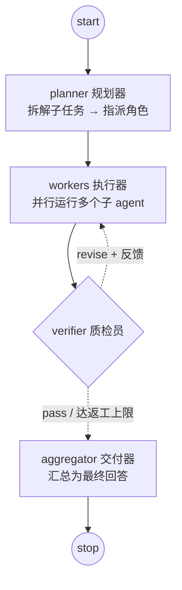
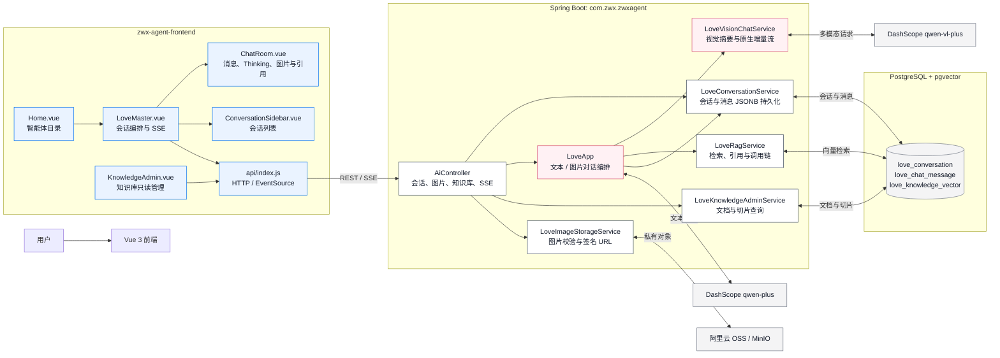
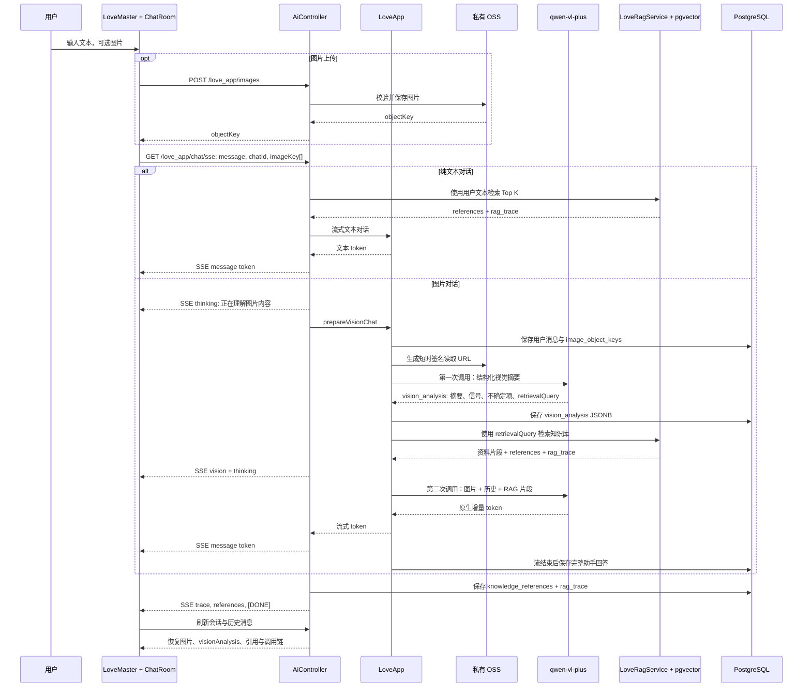

# ZWX Agent

ZWX Agent 是一个基于 Spring Boot、Spring AI 和 Vue 3 的 AI 应用项目，包含四个智能体：面向情感咨询场景的"情感分析大师"、可联网检索的"旅游规划专家"、"功能测试助手"，以及基于**多智能体图状态机**协作的"超级智能体（Manus）"——由规划器拆解任务、多个子智能体并行执行、质检员验收返工、交付器统一汇总。项目同时具备 RAG、工具调用、MCP、Skill 与执行链路可视化能力。

## 原项目与作者

本项目基于 [程序员鱼皮（liyupi）的 yu-ai-agent](https://github.com/liyupi/yu-ai-agent) 二次开发。

- 原作者：程序员鱼皮（liyupi）
- 原项目仓库：[github.com/liyupi/yu-ai-agent](https://github.com/liyupi/yu-ai-agent)
- 本仓库在保留原项目技术基础上进行了品牌、情感分析流程、图片多模态、会话持久化、PGVector RAG、引用与调用链可视化等改造。

## 当前能力

- 认证与多用户隔离：全部业务接口需要 JWT 登录（`POST /api/auth/register`、`POST /api/auth/login`）；会话、消息、图片与生成文件按用户强归属，管理接口需要 ADMIN 角色。
- 多轮 AI 对话：默认使用阿里云 DashScope 的 `qwen-plus`。
- **超级智能体（多智能体协作）**：基于 Spring AI Alibaba Graph 的图状态机——规划器拆解任务（≤4 个子任务）、按角色（调研员/撰写员/分析员/通用助理）并行执行、质检员验收（最多返工一轮）、交付器汇总；执行过程以结构化事件（阶段/角色/摘要）实时推送，MemorySaver checkpoint 按会话隔离，为断线恢复打底。
- **只读 SQL 工具**：智能体可查询本应用数据库（黑名单保护 `app_user` 等敏感表），或按用户提供的连接信息查询外部 PostgreSQL/MySQL 数据库；仅允许单条 SELECT，带表白名单、行数与超时限制（`app.tools.db-query-enabled`、`app.tools.db-query-external-enabled`，默认关闭）。
- 情感分析大师：提供针对情感问题的对话引导、关系分析与建议。
- 会话持久化：情感分析大师的会话和消息保存在 PostgreSQL；模型请求采用最近 20 条消息作为上下文窗口，并对历史长度做 token 预算截断；流中断时部分回答以 INTERRUPTED 状态落库，不丢轮次。
- 图片多模态：支持选择文件和粘贴图片，使用 `qwen-vl-plus` 理解图片内容。
- 私有图片存储：图片上传至阿里云 OSS，后端生成短时签名读取地址供视觉模型访问；聊天历史通过受控接口读取图片（校验会话归属）。
- 多租户私有知识库：管理端可为智能体上传 `.md`、`.txt` 等文档，同名文档幂等替换，支持删除；异步切片并写入 PGVector；检索始终限定为当前租户和智能体，且带超时降级与 degraded 标记。
- 旅游规划专家：基于行程偏好、该智能体的私有资料和受限联网搜索工具生成方案；天气、交通、营业时间等实时信息优先检索，不配置额外地图或天气数据源。
- 工具安全边界：LLM 工具运行在会话级沙箱目录内，路径穿越与内网地址（SSRF）被拦截；终端工具默认关闭，可用 `app.tools.terminal-enabled=true` 开启白名单版本。
- 并发防护：会话级互斥（同一会话并发发送返回 409）；智能体执行、RAG 检索与图工作者使用专用线程池；客户端断开后服务端联动停止主图与全部子智能体。
- 扩展能力：MCP 动态注册（仅接受可解析的公网 HTTP(S) 地址）、Skill 提示词与工具授权、执行链路（run/event）持久化与前端可视化。

## 功能路线图

每个模块的已完成能力、待办项、进度和近期优先级见 [doc/ROADMAP.md](doc/ROADMAP.md)。该清单以仓库实现为准：未实现的能力会明确标注为待做，不会按设想计入完成度。

项目内置 Skill 的授权、提示词触发和工具执行链路见 [doc/skills.md](doc/skills.md)。

## 技术栈

- Java 21、Spring Boot 3.4、Spring AI、Spring AI Alibaba Graph（多智能体图编排）
- 阿里云 DashScope SDK、阿里云 OSS SDK
- PostgreSQL、PGVector
- Vue 3、Vite、Vue Router

## 整体架构

系统整体架构（架构图与分层说明）统一维护在 [design/agent-architecture.md](design/agent-architecture.md)，本文件只保留使用说明与功能介绍。

## 超级智能体：多智能体协作

详细设计见 [design/plans/06-multi-agent-graph.md](design/plans/06-multi-agent-graph.md)。



- **角色与工具白名单**：调研员（搜索/抓取/下载）、撰写员（读写文件/生成 PDF）、分析员（只读 SQL/白名单命令）、通用助理（全部工具含 MCP）；每个子智能体只能看到自己角色需要的工具。
- **受控返工**：质检员对照用户请求验收，不合格携带反馈回流 workers，最多返工一轮，`maxIterations=16` 兜底防死循环。
- **执行过程可视化**：后端推送结构化事件 `{"phase":"work","agent":"分析员","summary":"查询数据库 → 5"}`，前端按"角色 · 摘要"渲染；生成的文件自动提取为可预览附件。
- **安全与停止**：子智能体复用沙箱与白名单；客户端断开时联动停止主图与全部子智能体；checkpoint（MemorySaver）按 `threadId=会话ID` 隔离。

## 情感分析大师功能架构

### 系统总览



### 对话与图片 RAG 流程



### 模块职责与数据契约

| 层级 | 组件 / 类 | 作用 | 关键数据或事件 |
| --- | --- | --- | --- |
| 页面 | `Home.vue` | 展示并筛选智能体目录 | 路由跳转 |
| 页面 | `LoveMaster.vue` | 管理会话、上传图片、监听 EventSource | `thinking`、`vision`、`trace`、`references`、`[DONE]` |
| 组件 | `ChatRoom.vue` | 安全 Markdown、thinking 状态、图片预览、视觉摘要和引用展示 | `messages[]`、`visionAnalysis`、`ragTrace` |
| 组件 | `ConversationSidebar.vue` | 创建、切换和删除历史会话 | `love_conversation` |
| 页面 | `KnowledgeAdmin.vue` | 搜索文档、查看 pgvector 切片和原文 | 知识库管理接口 |
| API | `AiController` | REST/SSE 边界；按是否带图片选择文本或视觉分支 | `/love_app/chat/sse` |
| 编排 | `LoveApp` | 组合系统提示词、会话历史、RAG 和模型调用 | 最近 20 条消息 |
| 视觉 | `LoveVisionChatService` | 生成结构化视觉摘要，并使用 `streamCall` 流式回答 | `LoveVisionAnalysis` |
| RAG | `LoveRagService` | 对 `love_knowledge_vector` 检索、生成引用和 trace、限制片段长度 | `LoveRagResult`、`LoveRagTrace` |
| 存储 | `LoveImageStorageService` | 校验图片、保存私有对象、生成短时签名 URL | `image_object_keys` |
| 会话 | `LoveConversationService` | 读写会话和消息；恢复历史展示所需元数据 | `vision_analysis`、`knowledge_references`、`rag_trace` JSONB |
| 数据 | PostgreSQL + pgvector | 保存会话、消息、向量文档及切片 | `love_conversation`、`love_chat_message`、`love_knowledge_vector` |

#### 图片消息持久化字段

`love_chat_message` 通过以下字段支持历史恢复与可追溯性：

- `image_object_keys`：私有对象存储键，不保存公开 URL。
- `vision_analysis`：裁剪后的视觉摘要、关系信号、不确定项和检索 query；不保存完整 OCR 原文。
- `knowledge_references`：实际命中的知识文档及章节。
- `rag_trace`：检索 query、Top K、相似度阈值、候选片段和调用决策。

### 大规模知识库运行方式

向量表初始化与文档索引已解耦：应用启动时仅创建/校验 `love_knowledge_vector`，不会扫描、切片或重建全部文档。内置知识文档需要通过任务接口索引：

```text
POST /api/ai/love_app/knowledge/index/built-in
GET  /api/ai/love_app/knowledge/index/jobs/{jobId}
```

任务按 100 个切片分批写入，单线程执行并将状态保存为 `PENDING`、`INDEXING`、`READY` 或 `FAILED`。检索默认预算为 800ms；超时或异常时返回空 RAG 上下文并继续模型回答，调用链会记录降级原因。生产环境面对百万级切片时，应继续按知识库/租户拆分向量表或数据库分区，并在摄取服务之外部署专用队列与 worker。

### 租户私有资料与旅游规划专家

管理端 `/knowledge-admin` 的“上传资料”入口只接受 `.md` 与 `.txt`。上传对象存入 `knowledge/{tenantId}/{agentKey}/...`，文档任务记录在 `agent_knowledge_document`，切片带有 `tenantId` 和 `agentKey` 元数据并写入 `agent_knowledge_vector`。问答检索使用二者的过滤条件，因此情感分析大师和旅游规划专家互不可见，两个租户之间也不会互相召回。

```text
POST /api/ai/agent-knowledge/documents   # multipart: agentKey=love|travel, file
GET  /api/ai/agent-knowledge/documents?agentKey=love|travel
GET  /api/ai/travel-planner/chat/sse?conversationId=...&message=...
```

租户身份从 JWT 派生，旧版 `X-Tenant-Id` 请求头与 `tenantId` 查询参数已废弃。

## 目录说明

```text
.
├── src/                              # Spring Boot 后端
│   └── main/java/com/zwx/zwxagent/
│       ├── agent/                    # 智能体核心（BaseAgent/ToolCallAgent 等）
│       │   └── graph/                # 多智能体图编排（planner/workers/verifier/aggregator）
│       ├── tools/                    # 内置工具（沙箱文件、搜索、只读 SQL、PDF 等）
│       ├── rag/                      # PGVector 检索与知识文档
│       ├── conversation/             # 会话持久化与互斥
│       └── ...
├── design/                           # 架构文档与实施方案（plans/01~06）
├── context/                          # 跨会话工作交接摘要
├── zwx-agent-frontend/               # Vue 3 前端
└── zwx-image-search-mcp-server/      # 可选的图片搜索 MCP 服务
```

## 前置条件

- JDK 21
- Maven 3.9+
- Node.js 18+
- PostgreSQL 及 PGVector（使用会话持久化和 RAG 时需要）
- DashScope API Key
- 阿里云 OSS Bucket 与具备对象读写权限的 RAM AccessKey（使用图片功能时需要）

## 本地配置

默认配置位于 `src/main/resources/application.yml`，本地敏感配置放入同目录的 `application-local.yml`。后者已被 Git 忽略，禁止提交。

可按实际环境创建以下配置，所有值仅作占位示例：

```yaml
spring:
  datasource:
    url: jdbc:postgresql://127.0.0.1:5432/zwx_agent
    username: YOUR_DB_USER
    password: YOUR_DB_PASSWORD
  ai:
    dashscope:
      api-key: YOUR_DASHSCOPE_API_KEY

app:
  oss:
    endpoint: https://oss-cn-hangzhou.aliyuncs.com
    bucket: YOUR_OSS_BUCKET
    access-key-id: YOUR_OSS_ACCESS_KEY_ID
    access-key-secret: YOUR_OSS_ACCESS_KEY_SECRET
```

图片功能使用的 RAM 权限至少应包括：

- `oss:PutObject`
- `oss:GetObject`
- `oss:DeleteObject`
- `oss:ListObjects`

建议将权限限制在目标 Bucket 和图片对象前缀内。OSS Bucket 保持私有访问，应用会生成临时签名 URL，不需要将 Bucket 公开。

## 启动后端

```bash
mvn spring-boot:run
```

后端默认地址为 `http://127.0.0.1:8123/api`，健康检查为：

```text
GET http://127.0.0.1:8123/api/health
```

### 登录与角色

除 `/health` 与 `/auth/**` 外，所有接口都需要 JWT：前端访问 `/login` 页面注册或登录。首次启动且用户表为空时会自动创建管理员 `admin`（默认密码 `admin123`），生产部署务必通过环境变量 `APP_SECURITY_ADMIN_PASSWORD` 覆盖，并通过 `JWT_SECRET` 设置稳定的签名密钥。知识库管理、Skill 启停保存、MCP 管理为 ADMIN 专属。

会话、消息与生成文件按用户归属隔离：请求中的 `chatId`/`conversationId` 必须属于当前用户；旧版 `X-Tenant-Id` 请求头与 `tenantId` 查询参数已废弃，租户身份从 JWT 派生。SSE 使用 fetch 流式读取以携带认证头。

接口文档地址：`http://127.0.0.1:8123/api/swagger-ui.html`（仅本地/开发 profile；生产 profile 已关闭）。

## Docker 部署与离线安装包

发布脚本参考模块化打包方式，但针对本项目采用了更轻的三服务部署：前端 Nginx、Spring Boot 后端和 PostgreSQL + pgvector。镜像是运行时镜像，服务器不会重新下载 Maven 或 NPM 依赖。

### 标准发布流程（速查）

1. **定版本**：发布版本号只通过 `VERSION` 环境变量传入（驱动镜像标签与安装包命名），`pom.xml` 保持 `0.0.1-SNAPSHOT` 不动——它与 `Dockerfile` 的 `JAR_FILE` 及桌面端 `prepare-backend.sh` 的 JAR 文件名联动，改动需三处同步，日常发版不建议动。
2. **构建前自检**（构建机）：后端 `mvn -q -DskipTests package` 通过、前端 `cd zwx-agent-frontend && npm run build` 通过。
3. **打包**：
   ```bash
   VERSION=0.0.2 TARGET_PLATFORM=linux/amd64 sh scripts/package.sh
   # 产物：release/zwx-agent-0.0.2-linux-amd64.tar.gz（离线镜像 + 编排 + 安装脚本 + 配置模板）
   ```
4. **传输**：`scp release/zwx-agent-0.0.2-linux-amd64.tar.gz user@server:/tmp/`，并保留本仓库与该 tar.gz 归档，作为回滚依据。
5. **服务器安装/升级**：解压 → 首次 `cp .env.example .env` 并填写 → `sudo ./install.sh` → 首次会自动创建 `/home/globe.conf`，填入 DashScope 密钥与 JWT 密钥后再执行一次 `sudo ./install.sh`。升级时跳过填写步骤，直接执行即可（`.env`、`globe.conf`、数据卷均保留）。
6. **部署验证**：
   ```bash
   cd /opt/zwx-agent
   docker compose --env-file .env ps            # 三个服务均为 Up/running
   curl -fsS http://127.0.0.1:8080/api/health   # 返回 ok
   docker compose --env-file .env logs -f backend   # 异常时看日志
   ```
   然后浏览器访问 `http://<服务器地址>:8080`，用管理员账号登录确认核心链路。
7. **升级到新版本**：用新版本号重复步骤 3-6；Flyway 迁移自动执行，数据不丢。
8. **回滚**：把上一版的 tar.gz 重新解压，在其中执行 `sudo ./install.sh` 即回到旧镜像（注意：若新版包含数据库迁移，回滚后可能需手工处理表结构，因此升级前建议先备份：
   ```bash
   cd /opt/zwx-agent
   set -a; source .env; set +a
   docker compose --env-file .env exec -T postgres \
     pg_dump -U "$POSTGRES_USER" "$POSTGRES_DB" > "backup-$(date +%F).sql"
   ```）。

以下小节是上述流程中各环节的详细说明。

### 构建镜像与安装包

构建机需要 Docker、JDK 21、Node.js 20+。默认构建 Linux x86_64 镜像，并将应用镜像和 pgvector 基础镜像一同导出，因此服务器可离线安装：

```bash
VERSION=0.0.1 TARGET_PLATFORM=linux/amd64 sh scripts/package.sh
```

产物为 `release/zwx-agent-<版本>-linux-amd64.tar.gz`，内容包括：

- `images/`：后端、前端和 pgvector 离线镜像。
- `docker-compose.yml`：前端、后端、PostgreSQL + pgvector 编排。
- `.env.example`：全部服务器配置项的无密钥模板。
- `globe.conf.example`：服务器外部配置模板（API Key、JWT 密钥等）。
- `install.sh`、`stop.sh`：安装、升级与停止脚本。

ARM 服务器可通过 `TARGET_PLATFORM=linux/arm64` 构建对应安装包。构建机需要具备该平台的 Docker 构建能力。

### 在服务器安装或升级

服务器只需 Docker Engine 与 Docker Compose v2。解压安装包，复制并填写环境文件后执行脚本：

```bash
tar -xzf zwx-agent-0.0.1-linux-amd64.tar.gz
cd zwx-agent-0.0.1-linux-amd64
cp .env.example .env
chmod 600 .env
# 编辑 .env，至少填写 POSTGRES_PASSWORD（DASHSCOPE_API_KEY 也可改填 /home/globe.conf）
sudo ./install.sh
# 首次执行会创建 /home/globe.conf，填写 DashScope 密钥与 JWT 密钥后重新执行
```

脚本默认部署到 `/opt/zwx-agent`；可以通过 `ZWX_AGENT_INSTALL_DIR=/srv/zwx-agent sudo -E ./install.sh` 改为其它固定目录。后续版本执行同一安装流程时会保留该目录已有的 `.env`、`temp/` 和 PostgreSQL 数据卷，只更新镜像与编排文件。

服务默认访问地址为 `http://<服务器地址>:8080`，可以通过 `.env` 的 `ZWX_AGENT_PORT` 修改。停止服务：

```bash
cd /opt/zwx-agent
sudo ./stop.sh
```

### 服务器外部配置 globe.conf

生产环境的密钥类配置（DashScope API Key、JWT 签名密钥、OSS/MinIO、搜索 API 等）维护在服务器的 `/home/globe.conf` 中，程序启动时自动读取，与本地环境的 `application-local.yml` 完全分离，不会打进镜像：

- 首次执行 `install.sh` 时，若 `/home/globe.conf` 不存在会自动从模板创建，填好后重新执行安装脚本即可。
- 格式为标准 properties（`key=value`，`#` 注释），UTF-8；可配置项见 `globe.conf.example`。
- 优先级最高：覆盖 `.env` 与 `application*.yml`。值为空或仍是 `YOUR_*`/`CHANGE_ME_*` 占位符时视为未配置，不会覆盖其它来源。
- 路径可通过 `.env` 的 `APP_GLOBE_CONF` 修改，容器内只读挂载，权限为 600。
- DashScope 密钥二选一：填 `.env` 的 `DASHSCOPE_API_KEY`，或填 `globe.conf` 的 `spring.ai.dashscope.api-key`，安装脚本两者都认。

管理员账号首次启动自动写入数据库（默认 `admin`/`admin123`，控制台会打印提醒），密码以 BCrypt 哈希保存在 PostgreSQL 中，不依赖环境变量；生产环境应在首次登录后尽快修改。

### 环境变量与持久化

`POSTGRES_PASSWORD` 是安装脚本校验的必填项；`DASHSCOPE_API_KEY` 在 `.env` 与 `globe.conf` 至少填写一处（见上节）。`SEARCH_API_API_KEY` 用于联网搜索；阿里云 OSS 四项用于图片与私有知识文档上传。它们只存在于服务器 `.env` 与 `globe.conf`，不会写进 Git、镜像或安装包。

应用临时目录由 `APP_TEMP_DIR` 控制，容器中固定为 `/app/temp`，映射到安装目录的 `temp/`。PDF 生成、下载和文件工具都使用该目录；应用未写入临时文件时目录保持为空。

## macOS 桌面版

桌面端位于 `zwx-agent-desktop/`，使用 Electron 封装同一份 Vue 前端，不复制后端逻辑。桌面版默认请求 `http://127.0.0.1:8123/api`；在任一智能体页面右上角设置菜单中可修改为部署服务器的完整 API 地址，例如 `https://agent.example.com/api`。地址保存在 macOS 应用数据目录，不会写入前端代码或安装包。

构建 Apple Silicon（M 系列）安装包：

```bash
cd zwx-agent-desktop
npm install
npm run dist:mac
```

生成的安装包在 `zwx-agent-desktop/release/`：

- `ZWX Agent-<版本>-arm64.dmg`：常规拖拽安装包。
- `ZWX Agent-<版本>-arm64-mac.zip`：便携分发包。

当前构建机未配置 Apple Developer ID，因此产物未公证。正式对外分发前，应配置 Developer ID Application 证书与 Apple notarization；否则首次打开时 macOS 可能需要在“隐私与安全性”中手动允许。

## 启动前端

```bash
cd zwx-agent-frontend
npm install
npm run dev -- --host 127.0.0.1
```

前端默认访问地址：`http://127.0.0.1:3000/`。智能体目录中的各页面：情感分析大师 `/love-master`、超级智能体 `/super-agent`、旅游规划专家 `/travel-planner`、功能测试助手 `/test-agent`。

## 验证构建

```bash
# 后端
mvn -DskipTests clean compile

# MCP 子服务
cd zwx-image-search-mcp-server
mvn -DskipTests clean compile

# 前端
cd ../zwx-agent-frontend
npm run build
```

## 图片对话流程

1. 前端通过文件选择或剪贴板粘贴图片。
2. 前端将图片上传到后端，后端校验 JPEG、PNG、GIF 格式及 10 MB 大小限制。
3. 后端将图片保存到私有 OSS，并仅在视觉模型请求时生成 15 分钟有效的签名 GET URL。
4. 后端将文本和图片 URL 作为多模态消息传给 `qwen-vl-plus`。
5. 消息记录保存图片对象键；恢复历史会话时，前端通过后端受控图片接口显示图片。

请避免上传宽或高不大于 10 像素的图片，视觉模型会拒绝此类图片。

## 安全说明

- 不要在 `application.yml`、README、提交记录或前端代码中写入 API Key、AccessKey、密码或 Token。
- `application-local.yml`、`.env*` 和 `.DS_Store` 已被 Git 忽略；提交前仍应使用 `git status` 检查暂存内容。
- 已暴露的 GitHub Token、云端 AccessKey 或模型 API Key 应立即撤销并重新生成。
