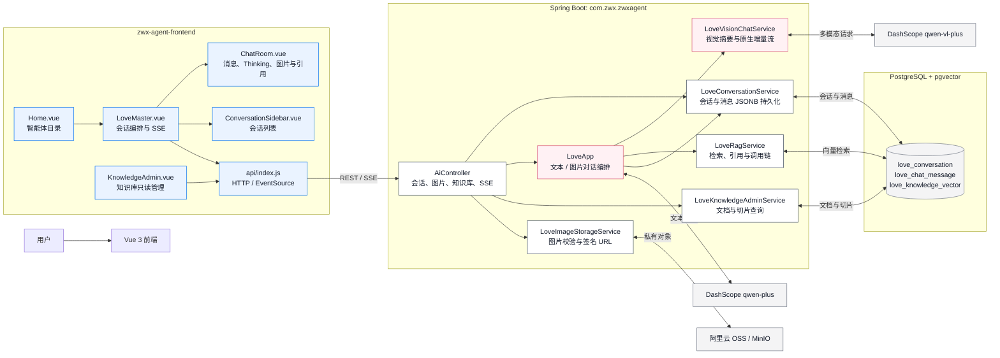
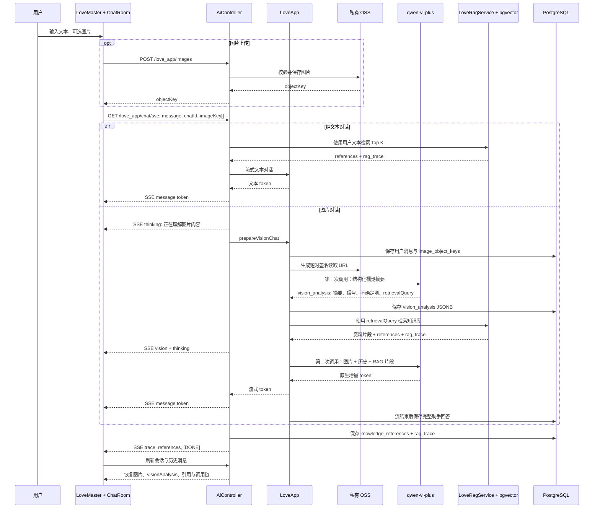

# ZWX Agent

ZWX Agent 是一个基于 Spring Boot 和 Vue 3 的 AI 应用项目，当前包含面向情感咨询场景的“情感分析大师”对话功能，以及可扩展的 RAG、工具调用、MCP 和自主规划智能体能力。

## 原项目与作者

本项目基于 [程序员鱼皮（liyupi）的 yu-ai-agent](https://github.com/liyupi/yu-ai-agent) 二次开发。

- 原作者：程序员鱼皮（liyupi）
- 原项目仓库：[github.com/liyupi/yu-ai-agent](https://github.com/liyupi/yu-ai-agent)
- 本仓库在保留原项目技术基础上进行了品牌、情感分析流程、图片多模态、会话持久化、PGVector RAG、引用与调用链可视化等改造。

## 当前能力

- 多轮 AI 对话：默认使用阿里云 DashScope 的 `qwen-plus`。
- 情感分析大师：提供针对情感问题的对话引导、关系分析与建议。
- 会话持久化：情感分析大师的会话和消息保存在 PostgreSQL；模型请求采用最近 20 条消息作为上下文窗口。
- 图片多模态：支持选择文件和粘贴图片，使用 `qwen-vl-plus` 理解图片内容。
- 私有图片存储：图片上传至阿里云 OSS，后端生成短时签名读取地址供视觉模型访问；聊天历史通过受控接口读取图片。
- 多租户私有知识库：管理端可为情感分析大师或旅游规划专家上传 `.md`、`.txt`，异步切片并写入 PGVector；检索始终限定为当前租户和智能体。
- 旅游规划专家：基于行程偏好、该智能体的私有资料和受限联网搜索工具生成方案；天气、交通、营业时间等实时信息优先检索，不配置额外地图或天气数据源。
- 扩展能力：项目保留了 RAG、PGVector、MCP、联网搜索、文件操作、网页抓取、资源下载、PDF 生成和 ReAct 智能体相关模块。

## 技术栈

- Java 21、Spring Boot 3.4、Spring AI
- 阿里云 DashScope SDK、阿里云 OSS SDK
- PostgreSQL、PGVector
- Vue 3、Vite、Vue Router

## 情感分析大师功能架构

### 系统总览



### 对话与图片 RAG 流程



### 模块职责与数据契约

| 层级 | 组件 / 类 | 作用 | 关键数据或事件 |
| --- | --- | --- | --- |
| 页面 | `Home.vue` | 展示并筛选智能体目录 | 路由跳转 |
| 页面 | `LoveMaster.vue` | 管理会话、上传图片、监听 EventSource | `thinking`、`vision`、`trace`、`references`、`[DONE]` |
| 组件 | `ChatRoom.vue` | 安全 Markdown、thinking 状态、图片预览、视觉摘要和引用展示 | `messages[]`、`visionAnalysis`、`ragTrace` |
| 组件 | `ConversationSidebar.vue` | 创建、切换和删除历史会话 | `love_conversation` |
| 页面 | `KnowledgeAdmin.vue` | 搜索文档、查看 pgvector 切片和原文 | 知识库管理接口 |
| API | `AiController` | REST/SSE 边界；按是否带图片选择文本或视觉分支 | `/love_app/chat/sse` |
| 编排 | `LoveApp` | 组合系统提示词、会话历史、RAG 和模型调用 | 最近 20 条消息 |
| 视觉 | `LoveVisionChatService` | 生成结构化视觉摘要，并使用 `streamCall` 流式回答 | `LoveVisionAnalysis` |
| RAG | `LoveRagService` | 对 `love_knowledge_vector` 检索、生成引用和 trace、限制片段长度 | `LoveRagResult`、`LoveRagTrace` |
| 存储 | `LoveImageStorageService` | 校验图片、保存私有对象、生成短时签名 URL | `image_object_keys` |
| 会话 | `LoveConversationService` | 读写会话和消息；恢复历史展示所需元数据 | `vision_analysis`、`knowledge_references`、`rag_trace` JSONB |
| 数据 | PostgreSQL + pgvector | 保存会话、消息、向量文档及切片 | `love_conversation`、`love_chat_message`、`love_knowledge_vector` |

#### 图片消息持久化字段

`love_chat_message` 通过以下字段支持历史恢复与可追溯性：

- `image_object_keys`：私有对象存储键，不保存公开 URL。
- `vision_analysis`：裁剪后的视觉摘要、关系信号、不确定项和检索 query；不保存完整 OCR 原文。
- `knowledge_references`：实际命中的知识文档及章节。
- `rag_trace`：检索 query、Top K、相似度阈值、候选片段和调用决策。

### 大规模知识库运行方式

向量表初始化与文档索引已解耦：应用启动时仅创建/校验 `love_knowledge_vector`，不会扫描、切片或重建全部文档。内置知识文档需要通过任务接口索引：

```text
POST /api/ai/love_app/knowledge/index/built-in
GET  /api/ai/love_app/knowledge/index/jobs/{jobId}
```

任务按 100 个切片分批写入，单线程执行并将状态保存为 `PENDING`、`INDEXING`、`READY` 或 `FAILED`。检索默认预算为 800ms；超时或异常时返回空 RAG 上下文并继续模型回答，调用链会记录降级原因。生产环境面对百万级切片时，应继续按知识库/租户拆分向量表或数据库分区，并在摄取服务之外部署专用队列与 worker。

### 租户私有资料与旅游规划专家

管理端 `/knowledge-admin` 的“上传资料”入口只接受 `.md` 与 `.txt`。上传对象存入 `knowledge/{tenantId}/{agentKey}/...`，文档任务记录在 `agent_knowledge_document`，切片带有 `tenantId` 和 `agentKey` 元数据并写入 `agent_knowledge_vector`。问答检索使用二者的过滤条件，因此情感分析大师和旅游规划专家互不可见，两个租户之间也不会互相召回。

```text
POST /api/ai/agent-knowledge/documents   # multipart: agentKey=love|travel, file
GET  /api/ai/agent-knowledge/documents?agentKey=love|travel
GET  /api/ai/travel-planner/chat/sse?tenantId=...&message=...
```

本地前端可用 `VITE_TENANT_ID` 设定测试租户，常规 REST 请求使用 `X-Tenant-Id`。浏览器的 `EventSource` 无法加自定义请求头，因此 SSE 使用 `tenantId` 查询参数。这里的租户值仅用于本地逻辑隔离；生产环境必须由认证后的服务端身份确定，不能直接信任客户端提交的租户值。

## 目录说明

```text
.
├── src/                              # Spring Boot 后端
├── zwx-agent-frontend/               # Vue 3 前端
└── zwx-image-search-mcp-server/      # 可选的图片搜索 MCP 服务
```

## 前置条件

- JDK 21
- Maven 3.9+
- Node.js 18+
- PostgreSQL 及 PGVector（使用会话持久化和 RAG 时需要）
- DashScope API Key
- 阿里云 OSS Bucket 与具备对象读写权限的 RAM AccessKey（使用图片功能时需要）

## 本地配置

默认配置位于 `src/main/resources/application.yml`，本地敏感配置放入同目录的 `application-local.yml`。后者已被 Git 忽略，禁止提交。

可按实际环境创建以下配置，所有值仅作占位示例：

```yaml
spring:
  datasource:
    url: jdbc:postgresql://127.0.0.1:5432/zwx_agent
    username: YOUR_DB_USER
    password: YOUR_DB_PASSWORD
  ai:
    dashscope:
      api-key: YOUR_DASHSCOPE_API_KEY

app:
  oss:
    endpoint: https://oss-cn-hangzhou.aliyuncs.com
    bucket: YOUR_OSS_BUCKET
    access-key-id: YOUR_OSS_ACCESS_KEY_ID
    access-key-secret: YOUR_OSS_ACCESS_KEY_SECRET
```

图片功能使用的 RAM 权限至少应包括：

- `oss:PutObject`
- `oss:GetObject`
- `oss:DeleteObject`
- `oss:ListObjects`

建议将权限限制在目标 Bucket 和图片对象前缀内。OSS Bucket 保持私有访问，应用会生成临时签名 URL，不需要将 Bucket 公开。

## 启动后端

```bash
mvn spring-boot:run
```

后端默认地址为 `http://127.0.0.1:8123/api`，健康检查为：

```text
GET http://127.0.0.1:8123/api/health
```

接口文档地址：`http://127.0.0.1:8123/api/swagger-ui.html`。

## 启动前端

## Docker 部署与离线安装包

发布脚本参考模块化打包方式，但针对本项目采用了更轻的三服务部署：前端 Nginx、Spring Boot 后端和 PostgreSQL + pgvector。镜像是运行时镜像，服务器不会重新下载 Maven 或 NPM 依赖。

### 构建镜像与安装包

构建机需要 Docker、JDK 21、Node.js 20+。默认构建 Linux x86_64 镜像，并将应用镜像和 pgvector 基础镜像一同导出，因此服务器可离线安装：

```bash
VERSION=0.0.1 TARGET_PLATFORM=linux/amd64 sh scripts/package.sh
```

产物为 `release/zwx-agent-<版本>-linux-amd64.tar.gz`，内容包括：

- `images/`：后端、前端和 pgvector 离线镜像。
- `docker-compose.yml`：前端、后端、PostgreSQL + pgvector 编排。
- `.env.example`：全部服务器配置项的无密钥模板。
- `install.sh`、`stop.sh`：安装、升级与停止脚本。

ARM 服务器可通过 `TARGET_PLATFORM=linux/arm64` 构建对应安装包。构建机需要具备该平台的 Docker 构建能力。

### 在服务器安装或升级

服务器只需 Docker Engine 与 Docker Compose v2。解压安装包，复制并填写环境文件后执行脚本：

```bash
tar -xzf zwx-agent-0.0.1-linux-amd64.tar.gz
cd zwx-agent-0.0.1-linux-amd64
cp .env.example .env
chmod 600 .env
# 编辑 .env，至少填写 POSTGRES_PASSWORD 与 DASHSCOPE_API_KEY
sudo ./install.sh
```

脚本默认部署到 `/opt/zwx-agent`；可以通过 `ZWX_AGENT_INSTALL_DIR=/srv/zwx-agent sudo -E ./install.sh` 改为其它固定目录。后续版本执行同一安装流程时会保留该目录已有的 `.env`、`temp/` 和 PostgreSQL 数据卷，只更新镜像与编排文件。

服务默认访问地址为 `http://<服务器地址>:8080`，可以通过 `.env` 的 `ZWX_AGENT_PORT` 修改。停止服务：

```bash
cd /opt/zwx-agent
sudo ./stop.sh
```

### 环境变量与持久化

`DASHSCOPE_API_KEY` 和 `POSTGRES_PASSWORD` 是安装脚本校验的必填项。`SEARCH_API_API_KEY` 用于联网搜索；阿里云 OSS 四项用于图片与私有知识文档上传。它们只存在于服务器 `.env`，不会写进 Git、镜像或安装包。

应用临时目录由 `APP_TEMP_DIR` 控制，容器中固定为 `/app/temp`，映射到安装目录的 `temp/`。PDF 生成、下载和文件工具都使用该目录；应用未写入临时文件时目录保持为空。

```bash
cd zwx-agent-frontend
npm install
npm run dev -- --host 127.0.0.1
```

情感分析大师页面：`http://127.0.0.1:3000/love-master`。

## 验证构建

```bash
# 后端
mvn -DskipTests clean compile

# MCP 子服务
cd zwx-image-search-mcp-server
mvn -DskipTests clean compile

# 前端
cd ../zwx-agent-frontend
npm run build
```

## 图片对话流程

1. 前端通过文件选择或剪贴板粘贴图片。
2. 前端将图片上传到后端，后端校验 JPEG、PNG、GIF 格式及 10 MB 大小限制。
3. 后端将图片保存到私有 OSS，并仅在视觉模型请求时生成 15 分钟有效的签名 GET URL。
4. 后端将文本和图片 URL 作为多模态消息传给 `qwen-vl-plus`。
5. 消息记录保存图片对象键；恢复历史会话时，前端通过后端受控图片接口显示图片。

请避免上传宽或高不大于 10 像素的图片，视觉模型会拒绝此类图片。

## 安全说明

- 不要在 `application.yml`、README、提交记录或前端代码中写入 API Key、AccessKey、密码或 Token。
- `application-local.yml`、`.env*` 和 `.DS_Store` 已被 Git 忽略；提交前仍应使用 `git status` 检查暂存内容。
- 已暴露的 GitHub Token、云端 AccessKey 或模型 API Key 应立即撤销并重新生成。
