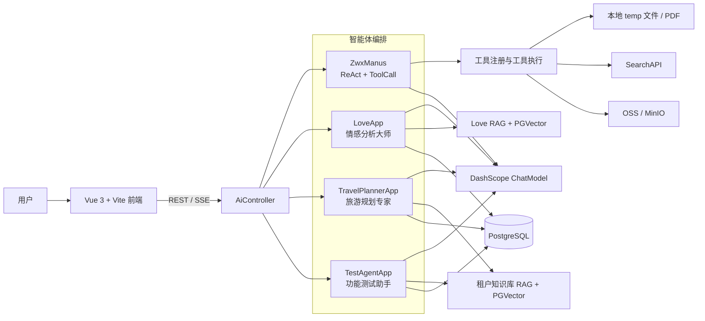
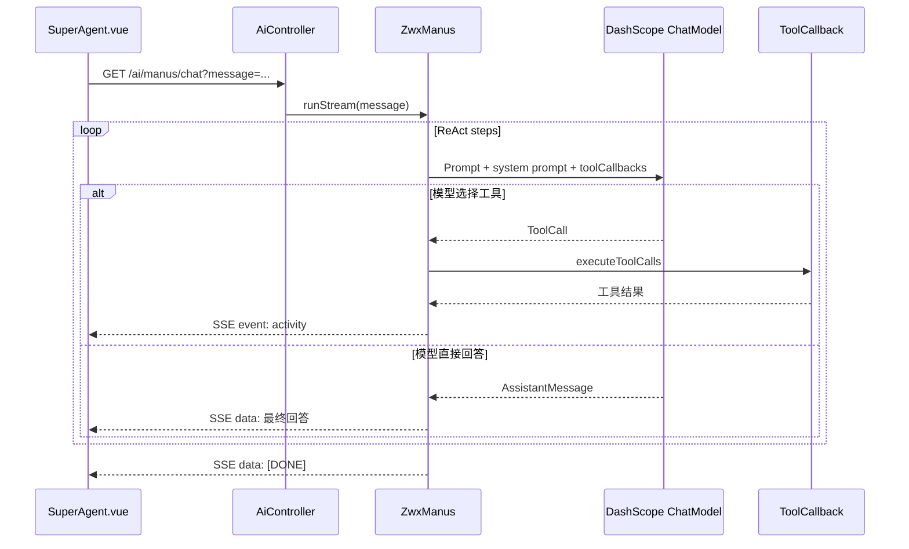

# ZWX Agent 当前智能体架构

> 本文按当前仓库源码整理，描述已经存在的模块和调用关系。未实现的规划能力不计入当前架构。

## 1. 系统总览

## 2. 运行单元

| 单元 | 位置 | 当前职责 |
| --- | --- | --- |
| 前端开发服务器 | `zwx-agent-frontend` | Vue 页面、聊天输入、SSE 消费、消息与执行过程展示 |
| Spring Boot 后端 | `src/main/java` | REST/SSE 边界、智能体编排、工具、RAG 和持久化 |
| PostgreSQL + pgvector | OrbStack / Docker | 会话、消息、知识库文档、向量数据 |
| OSS / MinIO | 外部或本地对象存储 | 私有图片、知识库文件等对象存储 |
| DashScope | 外部模型服务 | 对话、视觉分析和向量相关模型调用 |
| SearchAPI | 外部搜索服务 | `searchWeb` 工具的联网搜索能力 |

## 3. 前端层

### 3.1 页面与路由

- `Home.vue`：智能体目录。
- `SuperAgent.vue`：超级智能体，消费 `/api/ai/manus/chat` 的 SSE。
- `LoveMaster.vue`：情感分析大师，管理会话、图片、RAG 引用和流式回答。
- `TravelPlanner.vue`：旅游规划专家，管理租户会话、联网搜索和执行追踪。
- `TestAgent.vue`：功能测试助手，验证租户知识库智能体链路。
- `KnowledgeAdmin.vue`：知识库文档查看和管理。
- `SkillSettings.vue`：智能体技能配置。

### 3.2 公共组件与 API

- `ChatRoom.vue`：消息渲染、Markdown、图片、输入框、消息操作和活动折叠展示。
- `ConversationSidebar.vue`：会话创建、切换和删除。
- `api/index.js`：Axios REST 封装和 `EventSource` SSE 封装。
- `config/agents.js`：智能体展示元数据、标题、提示词和主题配置。

超级智能体的工具过程使用 SSE `activity` 事件；最终回答使用普通消息事件；`[DONE]` 表示流正常结束。前端默认只显示最终答复，用户展开“已执行 N 项操作”后查看步骤详情。

## 4. 后端接口层

核心控制器是 `AiController`，统一挂载在 `/api/ai`：

| 接口组 | 作用 |
| --- | --- |
| `/love_app/*` | 情感分析大师会话、图片、知识库和 SSE 对话 |
| `/manus/chat` | 超级智能体 SSE 对话 |
| `/travel-planner/*` | 旅游规划专家会话、SSE 和执行记录 |
| `/test-agent/*` | 功能测试助手会话和 SSE |
| `/agent-knowledge/*` | 租户知识库文档上传、查询和重建索引 |
| `/skills/*` | 技能目录和技能开关配置 |

`HealthController` 提供 `/api/health` 健康检查。

## 5. 超级智能体执行链

### 5.1 智能体基类

- `BaseAgent`：状态、消息列表、最大步骤数、同步运行和 SSE 流式运行。
- `ReActAgent`：定义 `think()` 和 `act()` 的思考-行动抽象。
- `ToolCallAgent`：使用 Spring AI `toolCallbacks(...)`，解析模型工具调用并交给 `ToolCallingManager` 执行；工具步骤输出为 `activity`。
- `ZwxManus`：超级智能体具体提示词、20 步上限和 DashScope `ChatClient`。
- `AgentState`：`IDLE`、`RUNNING`、`FINISHED`、`ERROR` 等状态。

### 5.2 当前已注册工具

`ToolRegistration` 汇总并暴露以下工具回调：

- `WebSearchTool.searchWeb`：调用 SearchAPI 搜索网页。
- `WebScrapingTool`：抓取网页内容。
- `ResourceDownloadTool`：下载远程资源。
- `FileOperationTool`：在 `FILE_SAVE_DIR/file` 读写文件。
- `PDFGenerationTool`：在 `FILE_SAVE_DIR/pdf` 生成 PDF，支持 `APP_PDF_FONT_PATH` 指定字体。
- `TerminalOperationTool`：执行终端操作。
- `TerminateTool`：结束智能体任务。

## 6. 三类业务智能体

### 情感分析大师

`LoveApp` 负责最近消息上下文、文本/图片分流、RAG 检索、视觉摘要、引用和消息持久化。图片由 `LoveImageStorageService` 保存并生成临时访问地址，`LoveVisionChatService` 调用视觉模型。

### 旅游规划专家

`TravelPlannerApp` 按 `tenantId` 和 `agentKey=travel` 过滤知识库，支持联网搜索，并通过 `AgentExecutionTraceService` 记录可展开的执行过程。

### 功能测试助手

`TestAgentApp` 复用租户知识库和会话服务，用于验证技能、文档上传、检索和 SSE 对话链路。

## 7. RAG 与数据层

### 向量检索

- `LoveRagService`、`LoveAppVectorStoreConfig`：情感分析大师知识库。
- `AgentKnowledgeRagService`、`AgentKnowledgeVectorStoreConfig`：按租户和智能体隔离的知识库。
- `LoveKnowledgeIndexService`、`AgentKnowledgeDocumentService`：文档解析、切片、索引任务。
- PGVector 表：`love_knowledge_vector`、`agent_knowledge_vector`。

### 会话与消息

- `LoveConversationService`：情感分析大师会话和消息。
- `AgentConversationService`：旅游规划专家、测试助手等通用智能体会话。
- `PostgresChatMemory`：将 Spring AI 消息上下文写入 PostgreSQL。

### 文件与对象存储

- `FileConstant`：默认文件根目录为项目 `temp`，可由 `APP_TEMP_DIR` 覆盖。
- `LoveImageStorageService`：图片上传、校验、签名 URL。
- `LoveKnowledgeDocumentStorageService`：知识库文档对象存储。
- `OssClientProvider`：OSS 客户端与配置。

## 8. 技能配置

`BuiltInSkillRegistry`、`SkillConfigurationService` 和 `SkillPromptBuilder` 负责技能目录、启用状态和提示词组合。技能配置会影响业务智能体可见的工具回调；超级智能体当前使用集中式 `ToolRegistration` 的全部工具。

## 9. 配置与启动依赖

- `application.yml`：公共 Spring Boot 配置和默认占位配置。
- `application-local.yml`：本地数据库、DashScope、OSS 和 SearchAPI 敏感配置，不应提交到 Git。
- `APP_TEMP_DIR`：工具文件和 PDF 根目录。
- `APP_PDF_FONT_PATH`：PDF 中文字体路径。
- PostgreSQL/pgvector：后端启动时必须可连接 `127.0.0.1:5432`。
- DashScope API Key：模型调用必需。
- SearchAPI Key：联网搜索工具必需，否则返回 `SEARCH_UNAVAILABLE`。

## 10. 当前边界与注意事项

1. 超级智能体当前是单次请求实例：`AiController` 每次请求创建新的 `ZwxManus`，不提供跨请求的 Manus 会话持久化。
2. 超级智能体的工具文件默认写入后端进程所在机器的 `temp` 目录，不会自动写入浏览器的系统 Downloads 目录。
3. SSE 连接由浏览器 `EventSource` 建立，前端通过事件类型区分最终消息和执行活动。
4. 本地 `tenantId` 只用于逻辑隔离；生产环境应由服务端认证身份确定租户，不能信任客户端直接提交的租户参数。
