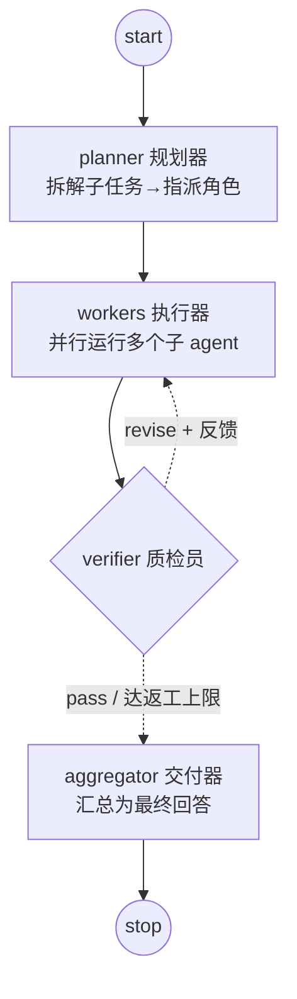
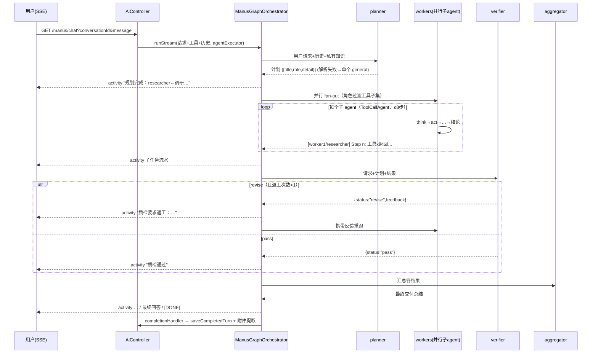

# 方案 06：基于 Spring AI Alibaba Graph 的多智能体重构

> 状态：**已实施并部署到本地环境**（manus 链路切换为图编排，旧 ReAct 类保留可回滚）。
> 前置：方案 01~05 已完成。依赖：`spring-ai-alibaba-graph-core:1.0.0.2`（由既有 BOM 管理版本）。

## 1. 目标与非目标

目标：
- manus 超级智能体支持**多 agent 协作**：规划器把请求拆解为子任务，多个子 agent **并行**执行，质检员验收，不合格返工一轮，最后统一交付。
- 编排显式化为**图状态机**（节点/边/条件路由），替代 `BaseAgent.run()` 的隐式 for 循环。
- 保持既有对外契约不变：SSE `activity` 事件、最终回答消息、`[DONE]`、`saveCompletedTurn` 落库、manus 附件提取（`GENERATED_FILE` 正则）。

非目标（后续阶段）：
- checkpoint 持久化与断点恢复（graph-core 支持 MemorySaver/RedisSaver/FileSystemSaver，接 `RunnableConfig.threadId=conversationId` 即可）；本阶段未启用以避免状态序列化问题。
- human-in-the-loop 中断审批（`compile(interruptBefore)` + `resume(HumanFeedback)` 已具备条件）。
- 子 agent 作为独立服务的 A2A 协议。

## 2. 图状态机

由 `ManusGraphOrchestrator.init()` 编译后经 `getGraph(MERMAID)` 生成（与代码一致）：



要点：
- **环**：`workers → verifier → workers` 是一条受控回路；`VerifierNode.MAX_REVISIONS = 1` 限制最多返工一轮，`CompiledGraph.maxIterations=16` 兜底防死循环。
- **并行**：graph-core 1.0.0.2 的 StateGraph 不直接暴露 fan-out 边；workers 节点内部用 `graphWorkerExecutor` 线程池对子任务做并行 fan-out（每个子 agent 一个 `CompletableFuture`）。

## 3. 一次运行的时序



## 4. 状态键（OverAllState）

| 键 | 合并策略 | 写入者 | 说明 |
|---|---|---|---|
| `input` | Replace | 入口 | 用户原始请求 |
| `history` | Replace | 入口 | 最近 20 条会话摘要（controller 拼好传入） |
| `run_context` | Replace | 入口 | `RunContext`：工具数组、私有知识、停止信号 `BooleanSupplier` |
| `plan` | Replace | planner | `List<PlanStep>(title, role, detail)`，≤4 个 |
| `task_results` | **Append** | workers | 每个子任务的结论（返工时追加） |
| `activities` | **Append** | 全部节点 | 内部留痕（附件提取依赖），**不再直接推给前端** |
| `sse_events` | **Append** | 全部节点 | 面向用户的语义事件 `ActivityEvent(phase, agent, summary)`，编排器差量序列化为 JSON 推送 |
| `revision` | Replace | verifier | 已返工轮次 |
| `verification_status` | Replace | verifier | `pass` / `revise` |
| `verification_feedback` | Replace | verifier | 返工反馈 |
| `final_answer` | Replace | aggregator | 最终交付文本 |

### SSE activity 事件格式（E2E 实测）

```json
{"phase":"plan","agent":"规划器","summary":"拆解为 2 个并行子任务：分析员←查询…；调研员←搜索…"}
{"phase":"work","agent":"分析员","summary":"开始执行（1/2）：查询 agent_conversation 表记录数"}
{"phase":"work","agent":"分析员","summary":"查询数据库 → \"1 row(s)\ncount\n5\n\""}
{"phase":"work","agent":"调研员","summary":"抓取网页 → \"WEB_PAGE_CONTENT from www.weather.com.cn…\""}
{"phase":"work","agent":"分析员","summary":"完成：agent_conversation 表中共有 5 条记录。"}
{"phase":"verify","agent":"质检员","summary":"结果通过验收"}
```

前端 `SuperAgent.vue` 解析 JSON 渲染为 `「角色 · 摘要」`，旧纯文本格式自动兜底。工具调用的中文标签映射在 `WorkerRole.toolLabel`。

## 5. 节点与角色

| 节点 | 类 | LLM 调用 | 失败降级 |
|---|---|---|---|
| planner | `PlannerNode` | 拆解 JSON | 回退单个 general 子任务 |
| workers | `WorkersNode` | 每个子 agent 一个 `ToolCallAgent`（复用 think 重试/工具执行加固） | 单个子任务失败不影响其他 |
| verifier | `VerifierNode` | 裁决 JSON | 按通过处理 |
| aggregator | `AggregatorNode` | 交付总结 | 回退为结果拼接 |

工作者角色与工具白名单（`WorkerRole`，general 不限制）：

| 角色 | 工具 |
|---|---|
| researcher | webSearch、scrapeWebPage、downloadResource |
| author | readFile、writeFile、generatePDF |
| analyst | executeDatabaseQuery、queryExternalDatabase、executeTerminalCommand |
| general | 全部（含 MCP） |

## 6. 新旧架构映射

| 旧 | 新 |
|---|---|
| `BaseAgent.run()` for 循环 | `CompiledGraph.stream()` 迭代 `NodeOutput` |
| `ZwxManus` 单 agent 逐步试错 | planner 显式规划 + 角色分工 + 并行执行 |
| 无质检，靠 activity 环检测兜底 | verifier 裁决 + 一轮受控返工 |
| SSE 事件在 `BaseAgent.runStream` 内发 | `ManusGraphOrchestrator.execute` 内发（契约不变） |
| `stopForClientDisconnect()` | `AtomicBoolean stopped` + `WorkersNode.stopAll()` 联动停止子 agent |

`ZwxManus`/`BaseAgent`/`ReActAgent`/`ToolCallAgent` 保留：`ToolCallAgent` 被子 agent 复用；`ZwxManus` 目前无人引用，作为回滚开关保留（把 controller 两行换回去即可）。

## 7. 配置

- `app.graph.executor.core-pool-size`（默认 6）/ `max-pool-size`（12）/ `queue-capacity`（50）：`graphWorkerExecutor`，manus 运行本身仍占 `agentExecutor` 一个线程。
- 验证过：`mvn test`（graph 包 16 个用例）；本地重启 health ok。图的真实 E2E（需要 DashScope）通过前端 manus 会话人工验证。

## 8. 遗留 / 下一步

- checkpoint 持久化（RedisSaver）+ `threadId=conversationId`，支持断线恢复与时间旅行调试
- `interruptBefore("verifier")` + `resume(HumanFeedback)` 做人工审批
- planner 输出结构化校验（json-schema）；子任务间依赖（DAG）而不是纯并行
- 前端 manus 活动面板按 worker 分组展示
